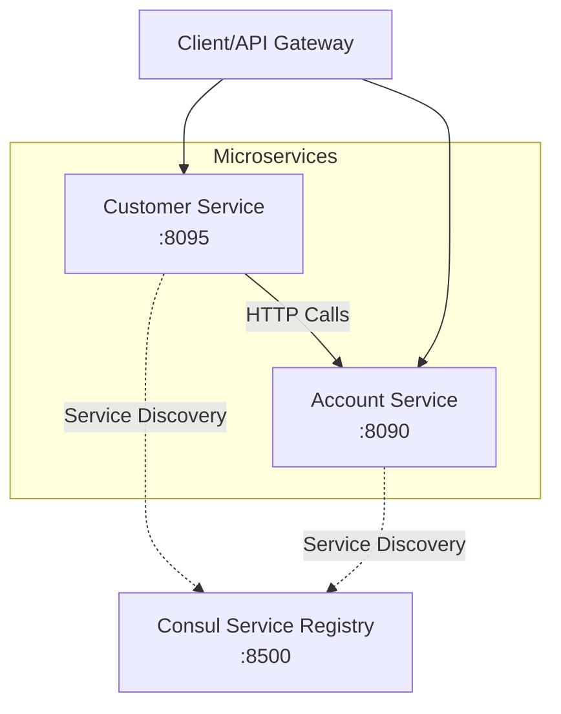

## Kotlin Microservices with Ktor  [](https://twitter.com/piotr_minkowski)

[](https://circleci.com/gh/piomin/sample-kotlin-ktor-microservices)

[](https://sonarcloud.io/dashboard?id=piomin_sample-kotlin-ktor-microservices)
[](https://sonarcloud.io/dashboard?id=piomin_sample-kotlin-ktor-microservices)
[](https://sonarcloud.io/dashboard?id=piomin_sample-kotlin-ktor-microservices)
[](https://sonarcloud.io/dashboard?id=piomin_sample-kotlin-ktor-microservices)

Detailed description can be found here: [Kotlin Microservices with Ktor](https://piotrminkowski.com/2018/10/09/kotlin-microservices-with-ktor/)

A sample project demonstrating microservices architecture using **Kotlin** and **Ktor** framework with **Consul** service discovery.

## 📖 Overview

This project showcases a microservices architecture with two main services:

- **Account Service**: Manages bank accounts with CRUD operations
- **Customer Service**: Manages customers and integrates with Account Service

Both services use Consul for service discovery and load balancing, demonstrating inter-service communication in a distributed system.

## 🏗️ Architecture



## 🛠️ Technology Stack

- **Language**: Kotlin 2.1.21
- **Framework**: Ktor 3.1.3
- **Build Tool**: Maven
- **Java Version**: 21
- **Service Discovery**: Consul
- **Serialization**: Jackson
- **Metrics**: Micrometer
- **Logging**: SLF4J with structured logging
- **HTTP Client**: Ktor Apache HTTP Client

## 📋 Prerequisites

Before running the application, ensure you have the following installed:

1. **Java 21** or higher
2. **Maven 3.6+**
3. **Consul** (for service discovery)

### Installing Consul

#### On macOS (using Homebrew)
```bash
brew tap hashicorp/tap
brew install hashicorp/tap/consul
```

#### On Windows (using Chocolatey)
```bash
choco install consul
```

#### On Linux
```bash
# Download and install Consul
wget https://releases.hashicorp.com/consul/1.17.0/consul_1.17.0_linux_amd64.zip
unzip consul_1.17.0_linux_amd64.zip
sudo mv consul /usr/local/bin/
```

## 🚀 Running the Application

### Step 1: Start Consul

Start Consul in development mode:

```bash
consul agent -dev
```

Consul will be available at: http://localhost:8500

### Step 2: Build the Project

From the root directory:

```bash
mvn clean compile
```

### Step 3: Start the Services

#### Option A: Start services individually

**Start Account Service** (in one terminal):
```bash
cd account-service
mvn exec:java -Dexec.mainClass="pl.piomin.services.AccountApplicationKt"
```

**Start Customer Service** (in another terminal):
```bash
cd customer-service
mvn exec:java -Dexec.mainClass="pl.piomin.services.CustomerApplicationKt"
```

#### Option B: Using Maven from project root

**Account Service**:
```bash
mvn -pl account-service exec:java -Dexec.mainClass="pl.piomin.services.AccountApplicationKt"
```

**Customer Service**:
```bash
mvn -pl customer-service exec:java -Dexec.mainClass="pl.piomin.services.CustomerApplicationKt"
```

### Step 4: Verify Services are Running

- Account Service: http://localhost:8090/accounts
- Customer Service: http://localhost:8095/customers
- Consul UI: http://localhost:8500/ui

You should see both services registered in the Consul UI.

## 📚 API Documentation

### Account Service (Port 8090)

| Method | Endpoint                         | Description                     | Example                                |
| ------ | -------------------------------- | ------------------------------- | -------------------------------------- |
| GET    | `/accounts`                      | Get all accounts                | `curl http://localhost:8090/accounts`  |
| GET    | `/accounts/{id}`                 | Get account by ID               | `curl http://localhost:8090/accounts/1`|
| GET    | `/accounts/customer/{customerId}`| Get accounts by customer ID     | `curl http://localhost:8090/accounts/customer/1`|
| POST   | `/accounts`                      | Create new account              | See example below                      |

#### Create Account Example
```bash
curl -X POST http://localhost:8090/accounts \
  -H "Content-Type: application/json" \
  -d '{
    "number": "1234567890",
    "balance": 1000,
    "customerId": 1
  }'
```

### Customer Service (Port 8095)

| Method | Endpoint                      | Description                            | Example                                |
| ------ | ----------------------------- | -------------------------------------- | -------------------------------------- |
| GET    | `/customers`                  | Get all customers                      | `curl http://localhost:8095/customers` |
| GET    | `/customers/{id}`             | Get customer by ID with accounts       | `curl http://localhost:8095/customers/1`|
| POST   | `/customers`                  | Create new customer                    | See example below                      |

#### Create Customer Example
```bash
curl -X POST http://localhost:8095/customers \
  -H "Content-Type: application/json" \
  -d '{
    "name": "John Doe",
    "type": "INDIVIDUAL"
  }'
```

## 🧪 Testing the Integration

1. **Create a customer**:
```bash
curl -X POST http://localhost:8095/customers \
  -H "Content-Type: application/json" \
  -d '{"name": "John Doe", "type": "INDIVIDUAL"}'
```

2. **Create an account for the customer**:
```bash
curl -X POST http://localhost:8090/accounts \
  -H "Content-Type: application/json" \
  -d '{"number": "1234567890", "balance": 1000, "customerId": 1}'
```

3. **Get customer with accounts** (demonstrates inter-service communication):
```bash
curl http://localhost:8095/customers/1
```

## 🔧 Configuration

### Port Configuration

Services run on the following ports by default:
- Account Service: 8090
- Customer Service: 8095
- Consul: 8500

To change ports, modify the `application.conf` files in each service's `src/main/resources` directory.

### Consul Configuration

Services are configured to connect to Consul at `http://localhost:8500`. To change this, update the Consul URL in the application code.

## 🐛 Troubleshooting

### Common Issues

1. **Port already in use**: Kill processes using the ports or change port configuration  
2. **Consul not available**: Ensure Consul is running on localhost:8500  
3. **Service discovery fails**: Check Consul logs and ensure services can reach Consul  
4. **Inter-service communication fails**: Verify both services are registered in Consul  

### Checking Service Health

Visit the Consul UI at http://localhost:8500/ui to verify:
- Both services are registered
- Services are healthy (green status)
- No connection issues

## 📖 Learning Resources

For detailed explanation and tutorial, check out the blog post: [Kotlin Microservices with Ktor](https://piotrminkowski.com/2018/10/09/kotlin-microservices-with-ktor/)

## 🤝 Contributing

Feel free to open issues and pull requests. For major changes, please open an issue first to discuss what you would like to change.

## 📄 License

This project is licensed under the MIT License - see the [LICENSE](LICENSE) file for details.
